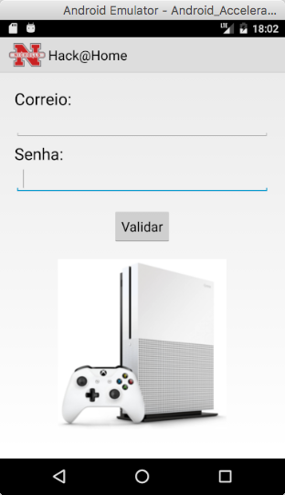
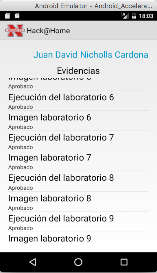
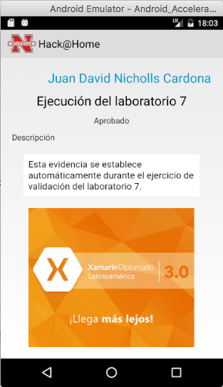

# Hack@Home 
A **Xamarin.Android** project for **Xamarin Diplomado 3.0**.

|
|

:---: |:---: |:---: |

# Introduction
[Intro.pdf](docs/HackAtHome.pdf)

# Other projects
- **[A Xamarin summary](https://github.com/proyecto26/Xamarin)**.

# Supporting
I believe in Unicorns 🦄
Support [me](http://www.paypal.me/jdnichollsc/2), if you do too.

# Happy coding
Made with <3

